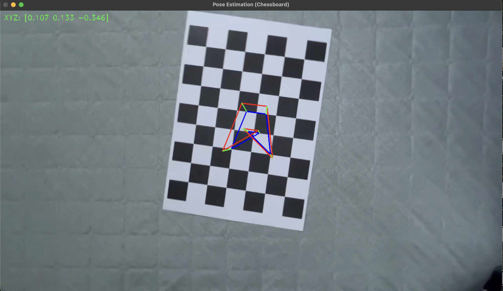
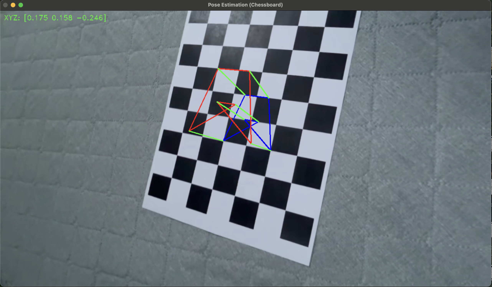

# 📐 Camera-Pose-Estimation-and-AR

본 프로젝트는 OpenCV를 이용해 **체스보드 패턴을 기반으로 카메라의 자세(Pose)를 추정**하고,  
그 결과를 바탕으로 **3D 알파벳 'A' 오브젝트를 체커보드 위에 증강현실(AR) 형태로 시각화**하는 프로그램입니다.

## 🔍 프로그램 소개

- 체커보드 영상(`my_chessboard_video.mp4`)에서 각 프레임을 분석하여
- OpenCV의 `findChessboardCorners`, `solvePnP` 함수를 사용해 **카메라의 위치와 방향**을 계산하고
- 미리 정의된 **3D 알파벳 'A' 모양의 가상 오브젝트**를 체스보드 위에 정확히 렌더링합니다.

## ⚙️ 주요 기능

- `cv.solvePnP`를 이용해 3D-2D 대응점 기반으로 실시간 카메라 위치 추정

- 3D 좌표계 상의 알파벳 'A' 도형을 체스보드 위에 증강하여 화면에 렌더링

- 내부 코너 수 `(6, 8)` / cell size `30mm` 설정 기반 정밀한 3D 모델 배치

## 🧪 캘리브레이션 측정

초기에는 다른 영상에서 측정한 카메라 내부 파라미터를 사용했지만, 보다 정확한 AR 오브젝트 위치를 얻기 위해 새로 측정한 영상으로 카메라 캘리브레이션을 재수행했습니다. 또한 영상이 세로로 찍힌 점을 고려해 기존의 (8 X 6)의 패턴을 (6 X 8)로 바꾸어 수행하였습니다. 

최종적으로 사용한 파라미터는 다음과 같습니다:

K = [[581.96789702, 0,  656.12544349], [0, 579.55040988, 353.90483831], [0, 0, 1]]

Dist_coeff = [-0.16136372, 1.17898597, 0.00444737, 0.005499, -2.31810614]

## 결과 데모

